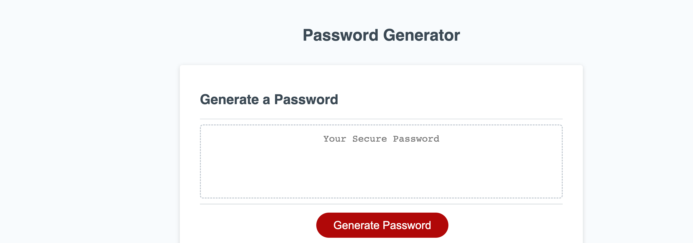

# password-generator
Password Generator

## Description

As an employee with access to sensitive data, I developed this random password generator to ensure that all member data is secure. The password generator is designed to create passwords with up to 128 characters to meet complex security requirements.

During the development process, I learned important programming concepts, such as variables, loops, and conditional statements. I used these concepts to create an application that allows users to select from a range of password criteria, including uppercase and lowercase letters, numbers, and special characters. With this password generator, I can now ensure that all sensitive data is kept secure.

## Table of Contents

- [Usage](#usage)
- [Credits](#credits)
- [License](#license)

## Usage

To generate a secure password, simply click the "Generate Password" button and follow the prompts to select the desired password criteria. The application will then use a random number generator to create a password that meets the specified criteria.

https://hexd9.github.io/password-generator/

 

## Credits

Learning Assistant: Megan  
Classmate: Ruben Ruiz  
LinkedIn Learning coursse:https://www.linkedin.com/learning/learning-the-javascript-language-2/learn-the-language-of-the-internet?autoplay=true&u=0 
MDN: https://developer.mozilla.org/en-US/docs/Web/JavaScript/Reference/Global_Objects/NaN 

## License

MIT License

Copyright (c) [2023] [HectorDelgado]

Permission is hereby granted, free of charge, to any person obtaining a copy of this software and associated documentation files (the "Software"), to deal in the Software without restriction, including without limitation the rights to use, copy, modify, merge, publish, distribute, sublicense, and/or sell copies of the Software, and to permit persons to whom the Software is furnished to do so, subject to the following conditions:

The above copyright notice and this permission notice shall be included in all copies or substantial portions of the Software.

THE SOFTWARE IS PROVIDED "AS IS", WITHOUT WARRANTY OF ANY KIND, EXPRESS OR IMPLIED, INCLUDING BUT NOT LIMITED TO THE WARRANTIES OF MERCHANTABILITY, FITNESS FOR A PARTICULAR PURPOSE AND NONINFRINGEMENT. IN NO EVENT SHALL THE AUTHORS OR COPYRIGHT HOLDERS BE LIABLE FOR ANY CLAIM, DAMAGES OR OTHER LIABILITY, WHETHER IN AN ACTION OF CONTRACT, TORT OR OTHERWISE, ARISING FROM, OUT OF OR IN CONNECTION WITH THE SOFTWARE OR THE USE OR OTHER DEALINGS IN THE SOFTWARE.

## Badges

